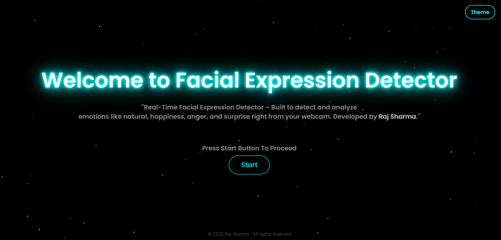
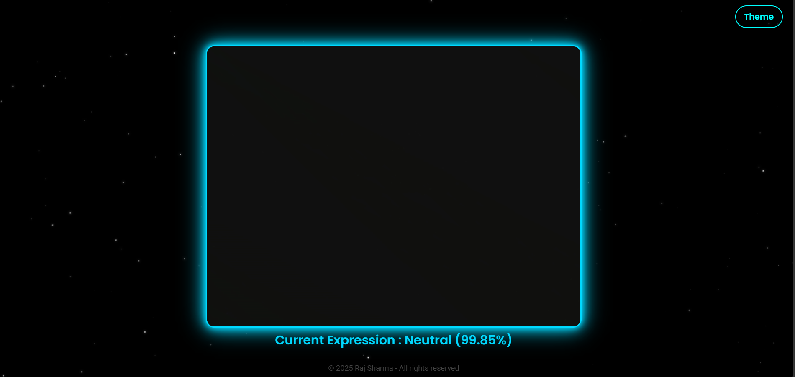

🎭 Facial Expression Detector — Web-based Expression Recognition Tool
Welcome to the Facial Expression Detector web app

This site showcases a browser-based tool that analyzes facial expressions (via webcam or uploaded image) and provides feedback on detected emotions. It is built to demonstrate skills in real-time media handling, UI/UX for interactive tools, and responsive design.

🌐 Live Site: https://facialexpressiondetector.netlify.app/

📌 About
Facial Expression Detector is a frontend web application project designed to let users detect and interpret facial expressions directly in the browser.
It demonstrates expertise in:

Accessing media devices (camera) or image files
Running face and expression recognition (using JavaScript / WebML / Web APIs)
Displaying results in real-time with intuitive UI
Implementing responsive design across desktop and mobile
This project is intended as a portfolio piece to highlight development & design capabilities.

✨ Features
🎥 Use webcam to capture live video stream and detect expressions
🖼 Upload image files for expression analysis
🙂 Recognize basic emotion states (happy, sad, surprised, neutral, etc)
🔄 Provide visual indicators of detected emotions and confidence
📱 Responsive UI – works on mobile and desktop
🧠 Real-time feedback with minimal latency
🛠️ Technologies Used
HTML5
CSS3 / Flexbox / Grid
JavaScript (ES6+)
MediaDevices API (navigator.mediaDevices.getUserMedia) for webcam access
Expression detection library ( face-api.js )
Netlify for hosting and deployment
📁 Folder Structure
All rights reserved.

## 📸 Screenshots

###  🌐 Landing Page

###  🎭 Expression Detection page

## Note : 
“The image shows a face, but it has been hidden for privacy reasons.”

You MAY:

View and study the code and design for learning purposes only. Use this as inspiration with proper credit given. You can ask for the media files ( images,video,icons) used in it For permissions, licensing, or collaborations, please contact:

Designer & Developer :

Name - Raj Sharma Email: hellojavos@gmail.com Website: https://facialexpressiondetector.netlify.app/
